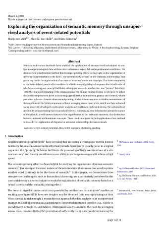
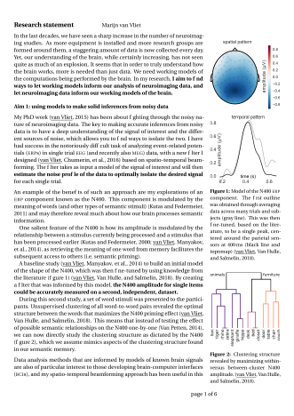
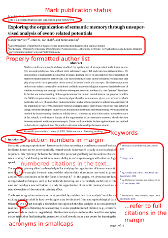
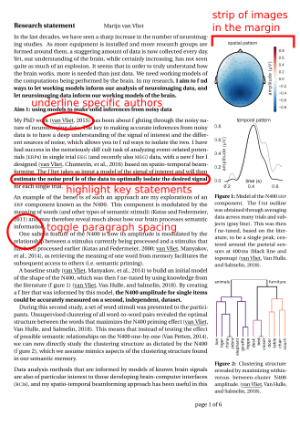

# Some LaTeX templates

Here are some LaTeX templates I use for:

 - Papers
 - Research statements

Their aim is to present scientific writing in a manner that provides comfortable reading of complicated subject matter.
Ideas are incorporated from Elsevier's templates, Tufte books and Philip Chimento's [dissertation template](https://github.com/ptomato/dissertation).

You can find all my papers, formatted with the `vanvliet_paper` template [here](https://users.aalto.fi/~vanvlm1).

## Examples

Journal paper | Research statement
--------------|-------------------
 | 
 | 

## Installation

Clone this repository and link the `templates/` folder into your local `texmf/` folder:

```
git clone https://github.com/wmvanvliet/latex_templates.git 
cd latex_templates
mkdir -p `kpsewhich -var-value=TEXMFHOME`/tex/latex/local
ln -s templates `kpsewhich -var-value=TEXMFHOME`/tex/latex/local/vanvliet_templates
```

## Usage

Two new LaTeX document classes are provided: `vanvliet_paper` and `vanvliet_research_statement`.
